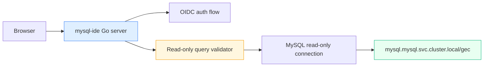

# MySQL IDE port and CoinVault debug deployment design

## Executive Summary

The recommended design is to turn the existing prototype in `/home/manuel/code/wesen/2026-03-27--mysql-ide` into a small Go web service that keeps the current retro HTML/vanilla-JS UI shell, replaces the Node proxy with a Go backend, and deploys the result as a separate authenticated debug workload in the existing `coinvault` namespace on K3s.

The most important design choices are:

- do **not** port the prototype’s arbitrary browser-supplied database connection model into the cluster
- run the tool against the existing CoinVault MySQL contract only:
  - host `mysql.mysql.svc.cluster.local`
  - database `gec`
  - read-only user `coinvault_ro`
- keep it as a separate deployment/service/ingress, not a sidecar inside the main CoinVault pod
- protect it with OIDC-backed browser auth
- restrict the query surface to safe read-only SQL plus dedicated schema endpoints

This produces a tool that is useful for operators, narrow enough to be safe, and aligned with the platform work already done in `HK3S-0007` and `HK3S-0009`.

## Problem Statement

CoinVault is now live on K3s, but the current operator debugging path for MySQL is still awkward. When something looks wrong in the app, the available tools are mostly:

- `kubectl exec` into the MySQL pod
- ad hoc one-shot client pods
- log inspection
- application behavior itself

That is enough for an experienced operator, but it is not a good ongoing debugging surface, especially when the question is “does the imported schema/data actually match what CoinVault expects?”

At the same time, the existing prototype in `/home/manuel/code/wesen/2026-03-27--mysql-ide` is not safe or deployable as-is:

- the browser sends raw `host`, `port`, `user`, `password`, and `database`
- the Node proxy executes arbitrary single statements
- there is no auth
- CORS is open
- there is no K3s or Argo packaging

So the real problem is not “we need a pretty SQL editor.” The real problem is:

> We need a narrow, authenticated, operator-facing SQL inspection tool that is fixed to the live CoinVault database contract and can be deployed under GitOps without reintroducing unsafe direct DB access patterns.

## Current State Analysis

### Prototype state

The prototype repo currently contains only two meaningful implementation files:

- [`QueryMac.html`](/home/manuel/code/wesen/2026-03-27--mysql-ide/imports/QueryMac.html)
- [`proxy-server.js`](/home/manuel/code/wesen/2026-03-27--mysql-ide/imports/proxy-server.js)

The HTML prototype already includes more than a textarea and a button. It has:

- a menu-bar style UI
- a query editor with syntax highlighting
- a schema tree
- connect/disconnect state
- `Run`, `Explain`, `Clear`, `Format`, and `Export CSV`
- a results table

The prototype frontend currently discovers schema and runs queries by issuing fetches to a local `/query` proxy. Examples visible in the HTML:

- `SHOW DATABASES`
- `SHOW TABLES FROM <db>`
- freeform SQL query execution

The Node proxy:

- accepts raw connection parameters from the browser
- opens a new MySQL connection per request
- executes one statement with `mysql2`
- does not validate SQL beyond `multipleStatements: false`
- returns errors with HTTP `200`

This is acceptable for a laptop toy. It is not acceptable for a live debug pod against the cluster database.

### Live CoinVault cluster state

The current CoinVault deployment already tells us the runtime contract we should target:

- [`gitops/kustomize/coinvault/deployment.yaml`](/home/manuel/code/wesen/2026-03-27--hetzner-k3s/gitops/kustomize/coinvault/deployment.yaml)
- [`gitops/kustomize/coinvault/service.yaml`](/home/manuel/code/wesen/2026-03-27--hetzner-k3s/gitops/kustomize/coinvault/service.yaml)
- [`gitops/kustomize/coinvault/ingress.yaml`](/home/manuel/code/wesen/2026-03-27--hetzner-k3s/gitops/kustomize/coinvault/ingress.yaml)

CoinVault already receives:

- `gec_mysql_host`
- `gec_mysql_port`
- `gec_mysql_database`
- `gec_mysql_ro_user`
- `gec_mysql_ro_password`

through the VSO-synced `coinvault-runtime` secret in namespace `coinvault`.

The shared MySQL deployment already exists and is validated:

- Argo app:
  - [`gitops/applications/mysql.yaml`](/home/manuel/code/wesen/2026-03-27--hetzner-k3s/gitops/applications/mysql.yaml)
- validation helper:
  - [`scripts/validate-cluster-mysql.sh`](/home/manuel/code/wesen/2026-03-27--hetzner-k3s/scripts/validate-cluster-mysql.sh)

The important implication is that the new IDE does **not** need a generic connection dialog in-cluster. The cluster already has the correct database contract.

### Existing auth and SQL-safety building blocks

CoinVault already has an OIDC-backed browser auth stack in:

- [`internal/auth/config.go`](/home/manuel/code/gec/2026-03-16--gec-rag/internal/auth/config.go)
- [`internal/auth/middleware.go`](/home/manuel/code/gec/2026-03-16--gec-rag/internal/auth/middleware.go)
- [`internal/auth/oidc.go`](/home/manuel/code/gec/2026-03-16--gec-rag/internal/auth/oidc.go)

CoinVault also already has a safe MySQL validator in:

- [`internal/sqltool/validate.go`](/home/manuel/code/gec/2026-03-16--gec-rag/internal/sqltool/validate.go)
- [`internal/sqltool/types.go`](/home/manuel/code/gec/2026-03-16--gec-rag/internal/sqltool/types.go)
- [`internal/sqltool/schema.go`](/home/manuel/code/gec/2026-03-16--gec-rag/internal/sqltool/schema.go)

That is important because it means the port should reuse existing ideas, not invent them blindly. But there is one twist:

- the validator currently disallows `SHOW` statements and blocks `information_schema`

That is correct for model-generated safe SQL. It is not sufficient unchanged for a human SQL IDE that needs schema browsing.

## Proposed Solution

Build a new Go service in `/home/manuel/code/wesen/2026-03-27--mysql-ide` with three layers:

1. **Embedded UI layer**
   - keep the current `QueryMac` look/feel as HTML/CSS/vanilla JS
   - remove the browser-owned connection dialog in cluster mode
   - point the UI at structured Go endpoints instead of a generic SQL proxy

2. **Go backend layer**
   - serve the static UI with `go:embed`
   - implement OIDC-protected browser auth
   - expose a narrow API:
     - `GET /healthz`
     - `GET /api/me`
     - `GET /api/schema`
     - `GET /api/schema/tables/:name/sample`
     - `POST /api/query`
   - connect to the live CoinVault MySQL contract with server-owned config only

3. **K3s deployment layer**
   - add a separate deployment under the existing CoinVault GitOps package
   - give it its own service and ingress
   - wire it to CoinVault’s DB contract and its own auth secret contract

### Recommended runtime shape



### Recommended cluster packaging

Keep the debug tool inside the existing CoinVault Argo application, but as a separate workload:

- new files under `gitops/kustomize/coinvault/`
  - `mysql-ide-deployment.yaml`
  - `mysql-ide-service.yaml`
  - `mysql-ide-ingress.yaml`
  - possibly `mysql-ide-vault-static-secret.yaml`
- referenced from the existing:
  - [`gitops/kustomize/coinvault/kustomization.yaml`](/home/manuel/code/wesen/2026-03-27--hetzner-k3s/gitops/kustomize/coinvault/kustomization.yaml)

That gives us:

- same namespace and operational bundle as CoinVault
- separate pod lifecycle
- separate ingress and auth boundary
- no need to create a second Argo application yet

### Recommended host and routing model

Use a separate hostname under the existing wildcard DNS, for example:

- `coinvault-sql.yolo.scapegoat.dev`

This is preferable to path-prefix routing under `coinvault.yolo.scapegoat.dev` because:

- it avoids root-path coupling with the main app
- it avoids shared UI route collisions
- it keeps auth callbacks and cookies simpler
- the wildcard `*.yolo.scapegoat.dev` already exists

### Recommended auth model

Use OIDC-backed browser auth, but do **not** block this ticket on extracting a perfect shared auth library first.

Recommended implementation order:

1. copy/adapt the CoinVault auth/session pattern into the new repo as a small internal package
2. use a dedicated cookie name and public URL
3. preferably use a dedicated Keycloak client for the SQL IDE
4. store the IDE-specific client secret/session secret in a new Vault path

This avoids over-coupling the debug tool to CoinVault’s exact session settings.

### Recommended SQL model

The SQL IDE should not expose a raw general-purpose SQL proxy. It should split the surface into two classes of endpoints:

#### 1. Server-owned schema inspection endpoints

These should generate the SQL internally and may safely use `information_schema`:

- list tables in the configured default schema
- return column metadata for a chosen table
- return a fixed-size sample query for a chosen table

#### 2. User-authored query endpoint

This should accept only read-only queries that pass validation.

Recommended semantics:

- single statement only
- `SELECT` and optionally `EXPLAIN`
- `WITH` allowed if we keep the existing validator behavior
- no DML/DDL
- no `SHOW`
- no `information_schema` access from raw user SQL
- enforced row cap
- enforced response-size cap
- enforced timeout

Pseudocode:

```text
POST /api/query
  read SQL from request
  parse and validate statement
  reject non-read-only statements
  normalize LIMIT / clamp rows
  execute using configured read-only DSN
  return rows + columns + canonical SQL + truncation info
```

This keeps the schema browser useful while making the dangerous path much narrower.

## Design Decisions

### Decision 1: Separate deployment, not sidecar

Recommendation:

- create a separate `Deployment` in namespace `coinvault`

Why:

- cleaner lifecycle than a sidecar
- independent resource sizing and restart behavior
- easier to hide/remove later
- avoids polluting the main CoinVault pod with operator-only UI concerns

### Decision 2: Same Argo package, not a new Argo application

Recommendation:

- keep the workload inside `gitops/kustomize/coinvault`

Why:

- the tool is an operator surface for the CoinVault stack, not a platform app in its own right
- it should evolve with the CoinVault runtime contract
- same namespace and same logical deployment bundle are helpful here

### Decision 3: Fixed DB config, no browser-owned connection settings

Recommendation:

- in cluster mode, remove arbitrary host/user/password/database configuration from the browser

Why:

- the correct database is already known
- browser-owned DB credentials are the wrong security model
- operator safety improves when the tool is scoped to exactly one database contract

### Decision 4: Read-only user plus read-only validator

Recommendation:

- use both:
  - `coinvault_ro` DB credentials
  - server-side SQL validation

Why:

- DB permissions are a good last line of defense
- server-side query restrictions produce clearer operator behavior and better error messages

### Decision 5: Preserve the UI shell first, port backend first

Recommendation:

- keep the current HTML/CSS/JS look and interactions in the first pass
- focus the Go port on backend, auth, and API shape

Why:

- lowest-risk path to a working tool
- avoids mixing a frontend rewrite with a backend/security rewrite
- the prototype already demonstrates the UI affordances we want

### Decision 6: Dedicated host under existing wildcard

Recommendation:

- use `coinvault-sql.yolo.scapegoat.dev` or similar single-label subdomain

Why:

- wildcard DNS already exists
- simpler than path-prefix routing
- easier Keycloak callback model
- clear separation from the main app

## Alternatives Considered

### Alternative A: Keep the Node proxy and just containerize it

Rejected because:

- no real auth model
- weak SQL safety
- generic arbitrary connection model
- poor fit for long-term operator ownership

### Alternative B: Put the tool in the main CoinVault pod as a sidecar

Rejected because:

- couples operator debugging UI to main app rollout
- makes CoinVault pod heavier and less focused
- harder to reason about ownership and failure modes

### Alternative C: Expose a raw mysql client pod through port-forward only

Rejected as the primary answer because:

- still too operator-local
- not a good browser/debug surface
- does not help a new intern understand the schema safely

### Alternative D: Put the tool behind ingress basic auth only

Rejected as the preferred model because:

- weaker identity continuity than OIDC
- separate password management burden
- worse long-term fit with the platform auth story

### Alternative E: Reuse CoinVault session cookies directly on the same host/path

Rejected as the preferred default because:

- more coupling than needed
- path/callback/session semantics become trickier
- a separate tool should have a separate auth contract even if it reuses the same IdP

## Implementation Plan

### Phase 1: Scaffold the Go application

Target repo:

- `/home/manuel/code/wesen/2026-03-27--mysql-ide`

Recommended shape:

```text
cmd/mysql-ide/main.go
internal/server/
internal/auth/
internal/db/
internal/sqlguard/
web/
  index.html
  static/
```

### Phase 2: Port the backend contract

Replace `proxy-server.js` with Go endpoints.

Recommended API:

- `GET /healthz`
- `GET /api/me`
- `GET /api/schema`
- `GET /api/schema/table/{name}`
- `GET /api/schema/table/{name}/sample`
- `POST /api/query`

### Phase 3: Adapt the frontend

Keep the current UI shell, but change the data sources:

- remove arbitrary connection inputs in cluster mode
- replace `SHOW DATABASES` / `SHOW TABLES` calls with structured schema APIs
- show the fixed runtime target label instead of user-supplied host/user

### Phase 4: Add auth

- create or copy a small auth/session package into `mysql-ide`
- wire OIDC login/logout/callback routes
- protect `/api/*` and `/`
- leave `/healthz` unauthenticated

### Phase 5: Add deployment manifests

In `2026-03-27--hetzner-k3s`:

- add deployment/service/ingress manifests
- add auth secret sync if needed
- update the CoinVault kustomization
- optionally add a validation script for the IDE

### Phase 6: Validate

Success criteria:

- browser login required
- schema view shows the `gec` tables
- sample query works
- arbitrary write query is rejected
- the tool uses the cluster MySQL service, not an operator-supplied connection
- Argo reports `Synced Healthy`

## Open Questions

Key questions to resolve during implementation:

- exact hostname:
  - `coinvault-sql.yolo.scapegoat.dev`
  - or another single-label wildcard-safe host
- dedicated Keycloak client versus reusing the current CoinVault client
- whether to factor a shared auth package later or just copy the current pattern first
- whether the tool should allow `EXPLAIN` on user-authored SQL in v1
- whether to include saved snippets/history in v1 or keep the tool stateless

Current recommendation:

- separate host
- dedicated Keycloak client
- copy the auth pattern first, extract later only if needed
- allow `EXPLAIN`
- keep v1 stateless

## References

- Prototype UI:
  - [`QueryMac.html`](/home/manuel/code/wesen/2026-03-27--mysql-ide/imports/QueryMac.html)
- Prototype backend:
  - [`proxy-server.js`](/home/manuel/code/wesen/2026-03-27--mysql-ide/imports/proxy-server.js)
- CoinVault deployment:
  - [`deployment.yaml`](/home/manuel/code/wesen/2026-03-27--hetzner-k3s/gitops/kustomize/coinvault/deployment.yaml)
  - [`ingress.yaml`](/home/manuel/code/wesen/2026-03-27--hetzner-k3s/gitops/kustomize/coinvault/ingress.yaml)
- CoinVault auth:
  - [`config.go`](/home/manuel/code/gec/2026-03-16--gec-rag/internal/auth/config.go)
  - [`middleware.go`](/home/manuel/code/gec/2026-03-16--gec-rag/internal/auth/middleware.go)
  - [`server_bootstrap.go`](/home/manuel/code/gec/2026-03-16--gec-rag/internal/webchat/server_bootstrap.go)
- Safe SQL foundation:
  - [`validate.go`](/home/manuel/code/gec/2026-03-16--gec-rag/internal/sqltool/validate.go)
  - [`schema.go`](/home/manuel/code/gec/2026-03-16--gec-rag/internal/sqltool/schema.go)
- Related tickets:
  - [`HK3S-0007`](/home/manuel/code/wesen/2026-03-27--hetzner-k3s/ttmp/2026/03/27/HK3S-0007--recreate-the-first-application-on-k3s-using-vault-managed-secrets/index.md)
  - [`HK3S-0009`](/home/manuel/code/wesen/2026-03-27--hetzner-k3s/ttmp/2026/03/27/HK3S-0009--add-cluster-level-postgres-mysql-and-redis-under-argo-cd/index.md)
