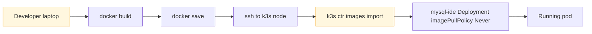
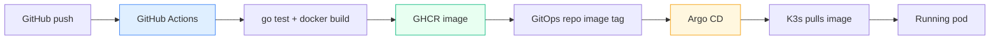

# GitHub Actions and GHCR image pipeline design for mysql-ide

## Executive summary

`mysql-ide` is already live on K3s, but its image delivery path is still a development shortcut. The current runtime depends on a local operator machine building a Docker image and importing it directly into the single K3s node. That was acceptable for the first deployment because it removed registry and CI complexity while the app and deployment were still being debugged. It is not acceptable as the long-term release path.

The recommended end-state is:

- source code stays in the `mysql-ide` app repo
- GitHub Actions becomes the build and publish system
- GHCR becomes the container registry
- the K3s GitOps repo references immutable image tags
- Argo CD remains the deploy and reconciliation system

The short version is:

```text
app repo push
  -> GitHub Actions test/build
  -> GHCR image publish
  -> GitOps repo image tag update
  -> Argo CD sync
  -> running pod
```

The important design decision is what *not* to do:

- do not ask Argo CD to build images
- do not install a cluster-local build system yet

This cluster already has a clean separation between “build artifacts somewhere else” and “deploy cluster state from Git.” The image path should reinforce that separation, not blur it.

## Why this change is needed

The current deployment in [mysql-ide-deployment.yaml](/home/manuel/code/wesen/2026-03-27--hetzner-k3s/gitops/kustomize/coinvault/mysql-ide-deployment.yaml) still says:

```yaml
image: mysql-ide:hk3s-0010
imagePullPolicy: Never
```

That means Kubernetes will only start the pod if the node already has a local image called `mysql-ide:hk3s-0010`. Right now that image arrives through [build-and-import-mysql-ide-image.sh](/home/manuel/code/wesen/2026-03-27--hetzner-k3s/scripts/build-and-import-mysql-ide-image.sh), which does this:

```text
docker build locally
  -> docker save
  -> ssh to k3s node
  -> k3s ctr images import
```

That approach has four serious long-term problems:

1. It depends on one operator workstation.
2. It does not scale cleanly beyond one cluster node.
3. It hides the real runtime artifact outside GitHub and outside the cluster config.
4. It makes rollback and reproducibility harder than necessary.

For a real operational platform, the running image should be:

- built in CI
- addressable by a registry URL
- reproducible from a commit
- visible in GitOps state

## What each system should do

One of the most important lessons for a new intern is that “deployment” is actually several separate jobs.

### 1. GitHub Actions

GitHub Actions should:

- run tests
- build the container image
- publish the image to GHCR
- optionally update the GitOps repo or open a PR for the new image tag

GitHub Actions should *not*:

- apply manifests to the cluster directly in the normal path
- replace Argo CD as the deployment controller

### 2. GHCR

GHCR should:

- store versioned container images
- provide immutable pull targets
- act as the bridge between app repo CI and cluster runtime

### 3. GitOps repo

The K3s repo should:

- declare which image tag the cluster wants
- keep the deployment manifest and runtime config in Git
- be the source of truth Argo reconciles from

### 4. Argo CD

Argo CD should:

- watch Git
- apply the manifests
- compare desired state versus live state
- repair drift

Argo CD should *not*:

- compile Go code
- build container images
- act as a CI system

## Current system versus target system

### Current path



### Target path



The design goal is to move from an operator-owned artifact path to a durable system-owned artifact path.

## Recommendation

The recommended implementation has two pipelines, not one.

### Pipeline A: application build pipeline

Lives in the `mysql-ide` repo.

Responsibilities:

- run `go test ./...`
- build the Docker image from [Dockerfile](/home/manuel/code/wesen/2026-03-27--mysql-ide/Dockerfile)
- push the image to GHCR
- produce stable tags

### Pipeline B: deployment pipeline

Lives in the K3s GitOps repo.

Responsibilities:

- declare the desired image tag
- let Argo CD roll out the deployment
- keep deployment history reviewable in Git

That split matters because it keeps source build concerns and cluster desired state concerns separate.

## Image naming and tagging strategy

### Registry name

The simplest image name is:

```text
ghcr.io/wesen/mysql-ide
```

If the GitHub repository owner differs or the package ends up nested differently, the exact owner path may change, but the important point is that the image name should be:

- stable
- repo-aligned
- easy to infer from the source repo

### Required tags

Recommended minimum set:

- immutable commit SHA tag
  - example: `ghcr.io/wesen/mysql-ide:sha-1a2b3c4`
- `main` branch convenience tag
  - example: `ghcr.io/wesen/mysql-ide:main`

Optional:

- `latest`

I would not make `latest` the GitOps source of truth. It is acceptable as a convenience tag, not as the deployment contract.

### Why immutable tags matter

If the K3s repo points at `:latest`, you lose an important property:

- a Git commit no longer fully describes the artifact that should run

If the K3s repo points at `:sha-1a2b3c4`, then:

- the deployment is reviewable
- rollback is obvious
- Argo drift is easier to reason about

## Package visibility

For this workload, the simplest path is:

- make the GHCR package public

Why:

- the cluster can pull without extra registry credentials
- the setup stays small and easy to teach
- this is a runtime image, not a secret store

If later you decide the image must be private, then the cluster needs:

- an `imagePullSecret`
- registry credentials in Kubernetes

That is completely viable, but it adds extra moving parts that are not necessary for this first registry-backed pipeline.

## GitHub Actions design

The app repo currently has no `.github/workflows/` directory, so this would be a new capability.

### Workflow triggers

Recommended:

- `pull_request`
  - run tests and build validation
  - do not publish
- `push` on `main`
  - run tests
  - build image
  - publish image to GHCR

Optional later:

- semver tag pushes

### Workflow permissions

For GHCR publish with the built-in `GITHUB_TOKEN`, the workflow should grant:

```yaml
permissions:
  contents: read
  packages: write
```

This is one of the reasons GitHub Actions is the right first move. It gives a clean and standard path to publish packages without inventing a separate secret-management system just for image pushes.

### Workflow shape

Pseudocode:

```text
on pull_request:
  checkout
  setup go
  run tests
  docker build

on push to main:
  checkout
  setup go
  run tests
  docker metadata for tags/labels
  login to ghcr with GITHUB_TOKEN
  docker buildx build --push
```

### Why buildx even for one architecture

Even if the immediate target is only `linux/amd64`, `docker/build-push-action` plus Buildx is still the clean standard path in GitHub Actions:

- good caching
- clean metadata handling
- easy future extension to multi-arch

So I would start with:

- `linux/amd64`

and only add `linux/arm64` later if you actually need it.

## Deployment update strategy

This is the most important design choice after “use a registry.”

There are three main ways to move the new image tag into the GitOps repo.

### Option A: manual GitOps update

Operator edits the K3s manifest after a successful image publish.

Pros:

- simple
- explicit
- easy to understand

Cons:

- extra manual step
- easy to forget

### Option B: app-repo CI opens a PR against the GitOps repo

Pros:

- preserves review
- reduces manual transcription
- keeps Git as the deployment source of truth

Cons:

- requires cross-repo credentials or GitHub App setup
- slightly more moving parts

### Option C: Argo CD Image Updater

Pros:

- less manual work
- purpose-built for image tag management

Cons:

- adds another controller
- adds another moving part to teach and debug
- can obscure “who changed the image tag and why” if introduced too early

### Recommendation

Start with Option A or B.

My specific recommendation:

- first implementation: manual GitOps update
- second implementation, once stable: CI-created PR into the K3s repo
- evaluate Argo CD Image Updater only after that if the extra automation is clearly worth it

That sequencing is important because the current need is not “maximum automation.” The current need is:

- clarity
- reviewability
- minimal new failure modes

## Why not let Argo build the image?

A new intern will naturally ask this because Argo already “deploys things.” The answer is architectural.

Argo CD manages Kubernetes desired state. It is not designed to be the artifact build system. Mixing those two concerns makes the deployment system harder to reason about:

- build failures and deploy failures become tangled
- cluster credentials and build credentials start to overlap
- the cluster becomes responsible for producing its own runtime artifacts

That is usually the wrong dependency direction.

The clean direction is:

```text
source repo
  -> CI builds artifact
  -> registry stores artifact
  -> GitOps repo declares artifact version
  -> Argo deploys artifact
```

## Why not install another in-cluster build service now?

Possible systems include:

- Tekton
- Drone
- Woodpecker

Those are not bad tools. They are simply too much platform for the current problem.

Right now:

- source already lives on GitHub
- app repo is already remote
- GitHub Actions is close to the code
- GHCR is the simplest registry to pair with GitHub

So installing an in-cluster builder would add:

- more components
- more credentials
- more operator learning surface

without solving a problem GitHub Actions cannot already solve cleanly.

## Concrete manifest changes

Today the manifest says:

```yaml
image: mysql-ide:hk3s-0010
imagePullPolicy: Never
```

Recommended future shape:

```yaml
image: ghcr.io/wesen/mysql-ide:sha-1a2b3c4
imagePullPolicy: IfNotPresent
```

Or, if you want Kustomize image rewriting:

```yaml
images:
  - name: ghcr.io/wesen/mysql-ide
    newTag: sha-1a2b3c4
```

I prefer the Kustomize `images:` pattern when there are likely to be recurring image bumps, because it keeps the base manifest stable and moves tag churn into a cleaner patch point.

## Rollback model

One reason immutable tags are worth the trouble is that rollback becomes simple:

```text
bad image tag in GitOps repo
  -> revert the Git commit
  -> Argo syncs previous tag
  -> cluster pulls known-good image
```

Compare that to the current local-import path:

- which machine built the image?
- which exact bits were imported?
- is the previous node-local image still there?

The registry path is better because it makes rollback a first-class operation instead of a hopeful memory exercise.

## Security notes

### Registry auth

If the package is public:

- cluster pull is simple
- no `imagePullSecret` needed

If the package is private:

- create a GitHub token or GitHub App credential
- store it as a Kubernetes pull secret
- reference it in the ServiceAccount or Pod spec

For the first implementation, public is the right tradeoff unless there is a clear reason otherwise.

### CI auth

Preferred first choice:

- `GITHUB_TOKEN`

That keeps package publishing tied to GitHub’s normal workflow identity model instead of introducing a personal PAT for the basic case.

## Recommended implementation order

1. Add a GitHub Actions workflow in the `mysql-ide` repo.
2. Publish `ghcr.io/wesen/mysql-ide` from `main`.
3. Verify the package is publicly pullable.
4. Update the K3s deployment manifest to use the registry image.
5. Remove the manual import script from the normal rollout path.
6. Decide later whether tag bumps stay manual or become PR-driven.

## API and system references

GitHub Actions Docker publish docs:

- https://docs.github.com/en/actions/use-cases-and-examples/publishing-packages/publishing-docker-images

GitHub Container Registry docs:

- https://docs.github.com/en/packages/working-with-a-github-packages-registry/working-with-the-container-registry

Argo CD Image Updater docs:

- https://argocd-image-updater.readthedocs.io/en/latest/

## Final recommendation

Use GitHub Actions + GHCR now. Keep Argo CD as the deployment system, not the build system. Start with immutable SHA-tagged images and a Git-driven deployment update. Only add image-updater automation or in-cluster CI later if the simpler path becomes the bottleneck.
