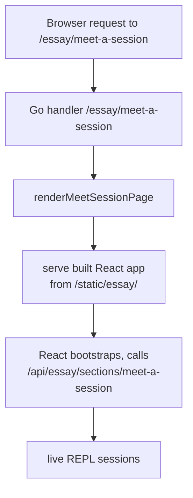

# Implementation guide: deploy goja-repl essay to K3s

## Executive summary

`goja-repl` already ships an interactive essay backend (`goja-repl essay`) and a React frontend (`web/`) that teaches users how the REPL works through live sessions. What is missing is the packaging and release contract that turns the repo into a public GitHub Actions -> GHCR -> GitOps PR -> Argo CD deployment.

The recommended deployment target is `goja.yolo.scapegoat.dev`, using the same public-app pattern already proven in the Hetzner K3s repo for `artifacts`, `pretext`, and `codebase-browser`. Unlike those apps, the essay is lightly stateful (SQLite session storage), so the GitOps package must include a writable volume for the database.

## Problem statement and scope

The problem is to make the goja-repl essay publicly available in a way that is reproducible, reviewable, and consistent with the platform's existing GitOps practices.

The scope is intentionally narrow:

- deploy the `goja-repl essay` subcommand as a public web service
- build and publish immutable images to GHCR
- let Argo CD roll the workload from a GitOps manifest change
- provide a persistent SQLite volume for session storage

Out of scope for this ticket:

- redesigning the essay UI or content
- changing the REPL engine or session model
- adding external databases (Postgres, etc.)
- introducing multi-region or HA deployment
- adopting an app-of-apps or ApplicationSet layer before the first rollout

## Current-state analysis

### The repo already has the right runtime shape

The root README describes `goja-repl` as a JavaScript REPL CLI, TUI, and JSON server (`README.md:1-12`). The `essay` subcommand is a first-class command that starts an HTTP server serving the interactive essay (`cmd/goja-repl/essay.go:1-71`).

The frontend lives in `web/` and is a standard Vite + React + TypeScript project (`web/package.json:1-35`). The build script is `pnpm build`, which runs `tsc --noEmit && vite build` and emits to `web/dist/public` with base path `/static/essay/` (`web/vite.config.ts:24-26`).

The backend finds the built frontend in one of two ways:
1. Via the `GOJA_REPL_ESSAY_WEB_DIST` environment variable (`pkg/replessay/handler.go:377-381`)
2. By walking up from the source file to `web/dist/public` (`pkg/replessay/handler.go:383-387`)

In a container, option 1 is the reliable path.

The essay handler serves:
- `/essay/meet-a-session` — the main essay page (`pkg/replessay/handler.go:93-101`)
- `/api/essay/sections/meet-a-session` — bootstrap JSON API (`pkg/replessay/handler.go:103-111`)
- `/api/sessions` and `/api/sessions/` — raw REPL session API (`pkg/replessay/handler.go:88-89`)
- `/static/essay/` — built Vite assets (`pkg/replessay/handler.go:90-91`)
- `/` — redirects to `/essay/meet-a-session` (`pkg/replessay/handler.go:86-87`)

The app uses SQLite for persistent session storage. The default database path is `goja-repl.sqlite` in the working directory, configurable via `--db-path` (`cmd/goja-repl/root.go:52`). The `repldb` package opens a standard `sqlite3` database with WAL mode and foreign keys (`pkg/repldb/store.go:1-71`).

### The build contract is already encoded in the Makefile

`Makefile:1-15` defines the standard Go targets: `test`, `build`, `lint`. `make build` runs `go generate ./...` followed by `go build ./...`. For the essay, the frontend build is a prerequisite that must happen before `go build` if the Go embed step depends on the dist directory. However, the current `go generate ./...` does not appear to build the frontend — that must be done manually with `pnpm -C web build`.

### What is missing today

The repo currently has no Docker packaging or image publishing in-tree. A root scan showed no `Dockerfile`, no image-publishing workflow, and no `deploy/` directory. The existing GitHub Actions are limited to `push.yml`, `lint.yml`, `dependency-scanning.yml`, and `release.yaml` — none of which build or push a container image.

That is the key gap: the essay runtime exists, but it is not yet packaged as a deployable artifact.

### The target pattern is already proven in the Hetzner K3s repo

The Hetzner repo already documents the exact public-app pattern. The source-app deployment playbook says the app repo should own source code, tests, Docker packaging, image publishing, deployment target metadata, and the workflow that opens GitOps pull requests (`docs/source-app-deployment-infrastructure-playbook.md:29-61, 168-246`). The public-repo playbook says the image should be built in GitHub Actions, published to GHCR, pinned in GitOps with an immutable SHA tag, and deployed by Argo CD (`docs/public-repo-ghcr-argocd-deployment-playbook.md:28-37, 63-83, 125-141, 202-257`).

The live K3s manifests for `artifacts`, `pretext`, and `codebase-browser` show the concrete public-app shape: a namespace, a deployment, a service, an ingress, and an Argo CD `Application` that points at a Kustomize package (`gitops/kustomize/*/`, `gitops/applications/*.yaml`).

## Architecture and data flow

```mermaid
flowchart LR
    A[go-go-goja source repo] --> B[GitHub Actions]
    B --> C[pnpm build
+ go build]
    C --> D[goja-repl binary
+ web/dist/public]
    D --> E[runtime image]
    E --> F[GHCR image tag
sha-<git-sha>]
    F --> G[GitOps repo image pin]
    G --> H[Argo CD Application]
    H --> I[Kubernetes Deployment
+ SQLite PVC]
    I --> J[goja.yolo.scapegoat.dev]

    style F fill:#dff7e4,stroke:#1f7a3e
    style G fill:#fff2cc,stroke:#b7791f
    style J fill:#dbeafe,stroke:#2563eb
```



The request path through the essay:



## Gap analysis

The missing pieces fall into four buckets.

1. **Application packaging**
   - There is no `Dockerfile` yet.
   - There is no `.github/workflows/publish-image.yaml` yet.
   - There is no `deploy/gitops-targets.json` yet.
   - The frontend build (`pnpm -C web build`) is not integrated into CI.

2. **GitOps runtime package**
   - There is no `gitops/kustomize/goja-essay/` package yet in the Hetzner repo.
   - There is no `gitops/applications/goja-essay.yaml` yet.
   - There is no ingress host entry for `goja.yolo.scapegoat.dev` yet.
   - The package must include a PVC for SQLite persistence.

3. **Cluster bootstrap**
   - Even after the manifests exist in Git, the `Application` object must still be applied once to the cluster.

4. **Operational proof**
   - We still need an end-to-end smoke test proving that the public endpoint serves the essay page, creates sessions, and persists state across pod restarts.

## Proposed solution

### 1. Package the app repo as a CI-built public image

The app repo should use a multi-stage Dockerfile:

1. **Frontend stage**: `node:22-slim` with pnpm, runs `pnpm install` and `pnpm build` in `web/`
2. **Backend stage**: `golang:1.24` (or matching Go version), copies the built frontend, runs `go build ./cmd/goja-repl`
3. **Runtime stage**: `gcr.io/distroless/base-debian12:nonroot` (or `debian:12-slim` because SQLite needs CGO and libc), copies the binary and `web/dist/public`

A sensible Dockerfile skeleton:

```dockerfile
# Stage 1: Build frontend
FROM node:22-slim AS web-builder
WORKDIR /app/web
COPY web/package.json web/pnpm-lock.yaml ./
RUN corepack enable && corepack prepare pnpm@10.15.0 --activate
RUN pnpm install --frozen-lockfile
COPY web/ .
RUN pnpm build

# Stage 2: Build Go binary
FROM golang:1.24-bookworm AS go-builder
WORKDIR /app
COPY go.mod go.sum ./
RUN go mod download
COPY . .
COPY --from=web-builder /app/web/dist/public ./web/dist/public
RUN CGO_ENABLED=1 go build -o bin/goja-repl ./cmd/goja-repl

# Stage 3: Runtime
FROM debian:12-slim
RUN apt-get update && apt-get install -y --no-install-recommends ca-certificates && rm -rf /var/lib/apt/lists/*
WORKDIR /app
COPY --from=go-builder /app/bin/goja-repl /app/goja-repl
COPY --from=web-builder /app/web/dist/public /app/web/dist/public
ENV GOJA_REPL_ESSAY_WEB_DIST=/app/web/dist/public
EXPOSE 8080
ENTRYPOINT ["/app/goja-repl"]
CMD ["essay", "--addr", ":8080", "--db-path", "/data/goja-repl.sqlite"]
```

Note: `CGO_ENABLED=1` is required because `mattn/go-sqlite3` is a CGO binding. This means we cannot use `distroless/static` and should use `debian:12-slim` or a custom image with libc and libsqlite3.

The build workflow should run on push to `main`:

1. checkout
2. setup Go, Node, pnpm
3. run `go test ./...`
4. run `pnpm -C web install --frozen-lockfile && pnpm -C web build`
5. build and push `ghcr.io/wesen/go-go-goja:sha-<shortsha>`
6. if `GITOPS_PR_TOKEN` is present, clone the GitOps repo, patch the image field, and open a PR

### 2. Publish immutable GHCR tags

The workflow should publish `sha-<shortsha>` as the immutable tag. The GitOps deployment must pin this tag. Convenience tags (`main`, `latest`) may be published but must not be used in GitOps.

### 3. Open GitOps pull requests from CI

Add `deploy/gitops-targets.json` to the app repo:

```json
[
  {
    "repo": "wesen/2026-03-27--hetzner-k3s",
    "path": "gitops/kustomize/goja-essay",
    "containerName": "goja-essay"
  }
]
```

The CI job should clone the GitOps repo, patch the container image in `gitops/kustomize/goja-essay/deployment.yaml`, and open a PR. Fail loudly if `GITOPS_PR_TOKEN` is missing.

Before the first push, bootstrap the secret:

```bash
cd /home/manuel/code/wesen/2026-03-27--hetzner-k3s
set -a
source .envrc
set +a
gh secret set GITOPS_PR_TOKEN --repo wesen/go-go-goja
```

### 4. Add the GitOps package in the Hetzner repo

Create a stateful public-app package that mirrors `codebase-browser` but adds a PVC and volume mount for SQLite:

- `gitops/kustomize/goja-essay/namespace.yaml`
- `gitops/kustomize/goja-essay/pvc.yaml` (for SQLite persistence)
- `gitops/kustomize/goja-essay/deployment.yaml`
- `gitops/kustomize/goja-essay/service.yaml`
- `gitops/kustomize/goja-essay/ingress.yaml`
- `gitops/kustomize/goja-essay/kustomization.yaml`
- `gitops/applications/goja-essay.yaml`

The deployment should:

- mount an `emptyDir` or `PersistentVolumeClaim` at `/data`
- set `enableServiceLinks: false`
- use `imagePullPolicy: IfNotPresent`
- expose readiness and liveness probes on `/api/essay/sections/meet-a-session` (returns 200 + JSON)
- size resources like a small web service (25m CPU request, 64Mi memory request, 256Mi limit)

A representative deployment skeleton:

```yaml
apiVersion: apps/v1
kind: Deployment
metadata:
  name: goja-essay
  annotations:
    argocd.argoproj.io/sync-wave: "1"
  labels:
    app.kubernetes.io/name: goja-essay
    app.kubernetes.io/component: web
spec:
  replicas: 1
  selector:
    matchLabels:
      app.kubernetes.io/name: goja-essay
      app.kubernetes.io/component: web
  template:
    metadata:
      labels:
        app.kubernetes.io/name: goja-essay
        app.kubernetes.io/component: web
    spec:
      enableServiceLinks: false
      containers:
        - name: goja-essay
          image: ghcr.io/wesen/go-go-goja:sha-<shortsha>
          imagePullPolicy: IfNotPresent
          ports:
            - containerPort: 8080
              name: http
          readinessProbe:
            httpGet:
              path: /api/essay/sections/meet-a-session
              port: http
            initialDelaySeconds: 3
            periodSeconds: 10
          livenessProbe:
            httpGet:
              path: /api/essay/sections/meet-a-session
              port: http
            initialDelaySeconds: 10
            periodSeconds: 20
          resources:
            requests:
              cpu: 25m
              memory: 64Mi
            limits:
              memory: 256Mi
          volumeMounts:
            - name: data
              mountPath: /data
      volumes:
        - name: data
          persistentVolumeClaim:
            claimName: goja-essay-data
```

The PVC:

```yaml
apiVersion: v1
kind: PersistentVolumeClaim
metadata:
  name: goja-essay-data
  annotations:
    argocd.argoproj.io/sync-wave: "0"
spec:
  accessModes:
    - ReadWriteOnce
  resources:
    requests:
      storage: 1Gi
```

The ingress should bind `goja.yolo.scapegoat.dev` with the usual `traefik` class and `letsencrypt-prod` cluster issuer.

### 5. One-time cluster bootstrap

Apply the Argo `Application` manually, then force a hard refresh:

```bash
cd /home/manuel/code/wesen/2026-03-27--hetzner-k3s
export KUBECONFIG=$PWD/kubeconfig-<server-ip>.yaml

kubectl apply -f gitops/applications/goja-essay.yaml
kubectl -n argocd annotate application goja-essay \
  argocd.argoproj.io/refresh=hard --overwrite
```

## Design decisions

1. **Treat this as a public stateful app.**
   The runtime has SQLite but no external database. A PVC is sufficient for session persistence.

2. **Use a multi-stage Dockerfile.**
   The frontend build (Node/pnpm) and backend build (Go/CGO) have different toolchain requirements. Multi-stage keeps the runtime image small.

3. **Use CGO-enabled Go build.**
   `mattn/go-sqlite3` requires CGO. This forces a glibc-based runtime image instead of distroless/static.

4. **Pin SHA tags in GitOps.**
   Immutable tags make review, rollback, and debugging straightforward.

5. **Fail loudly on missing PR credentials.**
   Silent skips are acceptable for optional features, not for the required release handoff.

6. **Bootstrap the Argo Application once, then let GitOps own the rest.**
   The Hetzner repo does not auto-discover new `Application` objects.

7. **Use `emptyDir` for the first rollout, then switch to PVC.**
   Actually, since sessions should persist across pod restarts, use a PVC from day one. If the app is truly ephemeral, `emptyDir` is acceptable, but the REPL essay is designed for users to create and revisit sessions.

## Alternatives considered

### Use distroless/static as runtime

Rejected because CGO-enabled SQLite binaries need libc. We could switch to a pure-Go SQLite driver (e.g., `modernc.org/sqlite`) in the future to enable distroless, but that is a code change, not a deployment change.

### Use an external Postgres database

Overkill for a single-node essay deployment. SQLite with a PVC is the right fit for this workload.

### Build everything inside the Dockerfile without CI caching

Would work but be slower. Using GitHub Actions with `actions/cache` for Go modules and pnpm store is the standard path.

### Deploy with manual node-local image import

The public-repo playbook explicitly treats node-local import as a fallback, not the standard path. For a public example page, we should not start with the bridge.

## Implementation plan

### Phase 1: app repo packaging

Files to add or update in `go-go-goja`:

- `Dockerfile`
- `.dockerignore`
- `.github/workflows/publish-image.yaml`
- `deploy/gitops-targets.json`
- `README.md` deployment section

Implementation notes:

- ensure `pnpm -C web install` and `pnpm -C web build` happen on a clean runner
- emit `ghcr.io/wesen/go-go-goja:sha-<shortsha>`
- fail the workflow if `GITOPS_PR_TOKEN` is absent and the PR step is required

### Phase 2: GitOps package in hetzner-k3s

Files to add in the infra repo:

- `gitops/kustomize/goja-essay/namespace.yaml`
- `gitops/kustomize/goja-essay/pvc.yaml`
- `gitops/kustomize/goja-essay/deployment.yaml`
- `gitops/kustomize/goja-essay/service.yaml`
- `gitops/kustomize/goja-essay/ingress.yaml`
- `gitops/kustomize/goja-essay/kustomization.yaml`
- `gitops/applications/goja-essay.yaml`

Implementation notes:

- mirror the `codebase-browser` app shape first
- use the hostname `goja.yolo.scapegoat.dev`
- keep `imagePullPolicy: IfNotPresent`
- use `enableServiceLinks: false`
- expose the pod on container port `8080`
- mount `/data` for SQLite persistence

### Phase 3: one-time cluster bootstrap

Apply the Argo `Application` and force a hard refresh as shown above.

### Phase 4: public validation

Smoke-test the rollout after Argo syncs:

- `https://goja.yolo.scapegoat.dev/essay/meet-a-session`
- `GET /api/essay/sections/meet-a-session`
- `POST /api/essay/sections/meet-a-session/session`
- verify the created session survives a pod restart (`kubectl delete pod -n goja-essay ...`)

## Testing and validation strategy

1. **Repo-level checks**
   - `go test ./...`
   - `pnpm -C web run check`

2. **Build checks**
   - `pnpm -C web build`
   - `go build ./cmd/goja-repl`
   - run `goja-repl essay --addr :8080 --db-path /tmp/test.sqlite` locally
   - `curl -fsS http://127.0.0.1:8080/api/essay/sections/meet-a-session`

3. **Container checks**
   - build the runtime image
   - run it locally on `:8080`
   - `curl -fsS http://127.0.0.1:8080/essay/meet-a-session`
   - `curl -fsS http://127.0.0.1:8080/api/essay/sections/meet-a-session`

4. **GitOps checks**
   - `kubectl -n argocd get application goja-essay`
   - verify `Synced` + `Healthy`
   - verify the deployment image matches the GitOps SHA tag
   - verify the ingress resolves over HTTPS

5. **User-visible checks**
   - load the essay page
   - create a session via the UI
   - evaluate some JavaScript
   - delete the pod and verify the session still loads

## Risks, alternatives, and open questions

- **Will the workflow need Dagger?**
  The repo already uses Dagger for some CI, but standard GitHub Actions with `docker/build-push-action` is sufficient for image publishing.

- **Should GHCR be explicitly public?**
  The deployment goal is public access, so the image should be pullable without cluster credentials. If GHCR visibility becomes a problem, the pull-secret path from HK3S-0014 is the fallback.

- **Should we use `emptyDir` instead of PVC for simplicity?**
  `emptyDir` loses data on pod restart. Since the essay invites users to create sessions, a PVC is the better default. We can document that the PVC is optional for truly ephemeral deployments.

- **What if the essay later needs multi-pod HA?**
  Then we would need to migrate from SQLite to Postgres or another shared database. That is a future infrastructure change, not a concern for the first rollout.

- **Should the Dockerfile use a non-root user?**
  Yes. The runtime stage should create a non-root user (e.g., UID 65534) and run the binary as that user. The `/data` directory must be writable by that user.

## References

Primary current-repo evidence:

- `/home/manuel/code/wesen/corporate-headquarters/go-go-goja/README.md:1-12`
- `/home/manuel/code/wesen/corporate-headquarters/go-go-goja/cmd/goja-repl/essay.go:1-71`
- `/home/manuel/code/wesen/corporate-headquarters/go-go-goja/cmd/goja-repl/root.go:52-110`
- `/home/manuel/code/wesen/corporate-headquarters/go-go-goja/pkg/replessay/handler.go:1-120, 376-390`
- `/home/manuel/code/wesen/corporate-headquarters/go-go-goja/pkg/repldb/store.go:1-71`
- `/home/manuel/code/wesen/corporate-headquarters/go-go-goja/web/package.json:1-35`
- `/home/manuel/code/wesen/corporate-headquarters/go-go-goja/web/vite.config.ts:1-38`
- `/home/manuel/code/wesen/corporate-headquarters/go-go-goja/Makefile:1-15`

Hetzner K3s deployment references:

- `/home/manuel/code/wesen/2026-03-27--hetzner-k3s/docs/source-app-deployment-infrastructure-playbook.md:29-61, 87-146, 168-246`
- `/home/manuel/code/wesen/2026-03-27--hetzner-k3s/docs/public-repo-ghcr-argocd-deployment-playbook.md:28-37, 63-83, 125-141, 202-257`
- `/home/manuel/code/wesen/2026-03-27--hetzner-k3s/gitops/kustomize/codebase-browser/*.yaml`
- `/home/manuel/code/wesen/2026-03-27--hetzner-k3s/gitops/applications/codebase-browser.yaml`

Contextual note from the vault:

- `/home/manuel/code/wesen/obsidian-vault/Projects/2026/03/29/PROJ - Serve Artifacts - Deploying to K3s with GitOps.md`
