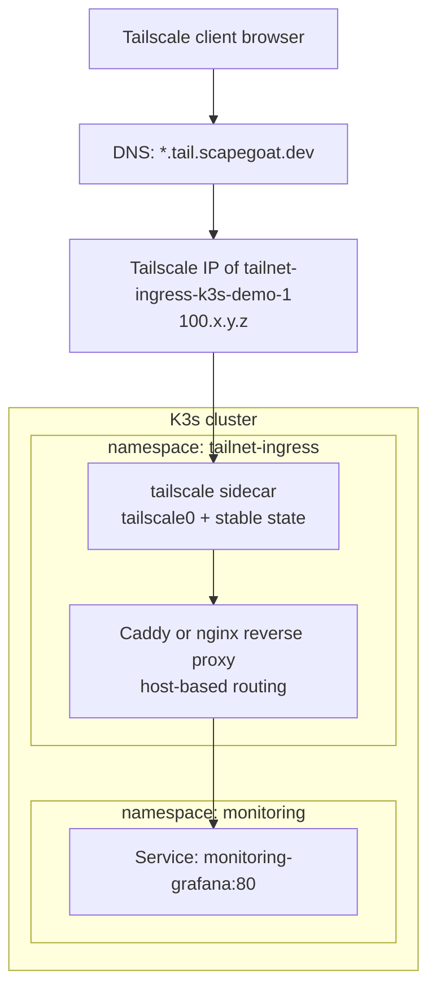

# Implementation Guide: Tailnet Wildcard DNS for Grafana

## Purpose

This playbook describes the pragmatic first implementation for exposing Grafana privately on the Tailscale network using a custom wildcard DNS zone. The goal is not to expose Grafana on the public Hetzner IP. The goal is to make a private URL such as:

```text
https://grafana.tail.scapegoat.dev
```

resolve for Tailscale-connected clients and route to the existing Kubernetes service:

```text
monitoring/monitoring-grafana:80
```

The chosen option is **Option 1: a single tailnet ingress proxy**. It is intentionally simpler than installing the full Tailscale Kubernetes Operator/Gateway stack. One pod joins the tailnet as a stable Tailscale device, a reverse proxy in that pod routes by hostname, and Terraform in `../terraform` manages the DNS wildcard record for `*.tail.scapegoat.dev`.

## Environment assumptions

- The K3s/GitOps repository is:

  ```text
  /home/manuel/code/wesen/2026-03-27--hetzner-k3s
  ```

- The shared Terraform repository that manages `scapegoat.dev` DNS is:

  ```text
  /home/manuel/code/wesen/terraform
  ```

- DNS scope currently documented by the Terraform repo is:

  ```text
  dns/zones/scapegoat-dev/envs/prod
  ```

- Grafana is already installed by `kube-prometheus-stack` in namespace `monitoring`.
- Grafana service is expected to be:

  ```text
  monitoring-grafana.monitoring.svc.cluster.local:80
  ```

- Tailscale is already used for node admin access, but this playbook creates a **separate tailnet service device** for private HTTP routing.
- The default private DNS zone for this ticket is:

  ```text
  tail.scapegoat.dev
  ```

- The first hostname to expose is:

  ```text
  grafana.tail.scapegoat.dev
  ```

## Design decision

Use these names unless deliberately changed before implementation:

| Concept | Name |
|---|---|
| Private DNS zone | `tail.scapegoat.dev` |
| Wildcard DNS record | `*.tail.scapegoat.dev` |
| Kubernetes namespace | `tailnet-ingress` |
| Tailscale device name | `tailnet-ingress-k3s-demo-1` |
| First routed app | `grafana.tail.scapegoat.dev` |
| Backend service | `http://monitoring-grafana.monitoring.svc.cluster.local` |

The namespace is named `tailnet-ingress`, not `grafana`, because the component should eventually expose multiple private admin services:

```text
grafana.tail.scapegoat.dev      -> monitoring/monitoring-grafana
prometheus.tail.scapegoat.dev   -> monitoring/monitoring-prometheus
alertmanager.tail.scapegoat.dev -> monitoring/monitoring-alertmanager
argocd.tail.scapegoat.dev       -> argocd/argocd-server
```

The DNS zone is named `tail.scapegoat.dev`, not `wildcard.scapegoat.dev`, because `tail` describes the purpose: these names are for tailnet access. `wildcard` describes an implementation detail.

## Architecture



The important boundary is that the public Traefik ingress is not in this path. The tailnet ingress proxy has a Tailscale interface and receives traffic over WireGuard from other tailnet clients. It forwards to normal Kubernetes service DNS inside the cluster.

## DNS model

The Terraform repository manages public DNS for `scapegoat.dev`. For this first version, use a public DNS wildcard record whose value is a Tailscale `100.x.y.z` address:

```text
*.tail.scapegoat.dev  A  100.x.y.z
```

A `100.64.0.0/10` Tailscale address is not publicly routable. Publishing it in public DNS is acceptable for a pragmatic first version if the hostname itself is not sensitive. Non-tailnet clients may resolve the name, but they cannot route to the address. Tailnet clients can route to it through Tailscale.

There is a more private future option: configure Tailscale split DNS for `tail.scapegoat.dev` and run a private resolver that answers the wildcard internally. That is not Option 1. Option 1 uses Terraform-managed DNS in `../terraform` because that is the existing DNS source of truth.

### Two-phase DNS bootstrap

The wildcard A record cannot be fully known until the tailnet ingress pod has joined Tailscale and received a stable Tailscale IP. This creates a two-phase sequence:

1. Deploy the tailnet ingress pod with persistent Tailscale state.
2. Read its Tailscale IP.
3. Add/update the wildcard DNS record in `../terraform`.
4. Apply Terraform DNS.
5. Validate `grafana.tail.scapegoat.dev` from a Tailscale client.

The Tailscale IP should remain stable as long as the Tailscale state is persisted and the node/device is not deleted from the tailnet admin console.

## TLS model

There are three possible TLS choices.

### Preferred: DNS-01 wildcard certificate

Use a certificate for:

```text
*.tail.scapegoat.dev
```

issued through DNS-01 against the DNS provider that hosts `scapegoat.dev`. This works because `grafana.tail.scapegoat.dev` is not publicly reachable, so HTTP-01 cannot validate it. The current cluster issuer uses HTTP-01 for public Traefik ingresses; that is not sufficient for tailnet-only services.

Implementation choices:

- Add a cert-manager `ClusterIssuer` or `Issuer` using DigitalOcean DNS-01.
- Store the DigitalOcean DNS token in Vault and render it with VSO, or create a tightly scoped Kubernetes Secret manually as an initial bootstrap.
- Add a `Certificate` in `tailnet-ingress` for `*.tail.scapegoat.dev`.
- Mount the resulting TLS Secret into the reverse proxy.

This is the clean browser experience and the recommended final shape for Option 1.

### Temporary MVP: HTTP over Tailscale WireGuard

Because Tailscale already encrypts traffic at the network layer, a temporary MVP can expose:

```text
http://grafana.tail.scapegoat.dev
```

This is acceptable only as a bootstrap/debugging step. It is not the desired final state because browsers and users expect HTTPS, and some apps generate absolute URLs or secure cookies based on scheme.

### Avoid: public Traefik HTTP-01

Do not route `grafana.tail.scapegoat.dev` through the public Traefik ingress just to get an HTTP-01 certificate. That defeats the point of a private tailnet endpoint.

## GitOps package shape

Create a new package:

```text
gitops/kustomize/tailnet-ingress/
  namespace.yaml
  serviceaccount.yaml
  vault-connection.yaml                 # if using VSO for Tailscale/DNS/cert secrets
  vault-auth.yaml                       # if using VSO
  vault-static-secret-tailscale.yaml    # renders TS auth key/OAuth client secret
  configmap-caddy.yaml                  # host routing config
  certificate.yaml                      # if using cert-manager DNS-01 TLS
  deployment.yaml                       # Tailscale sidecar + reverse proxy
  service.yaml                          # optional internal service for debugging
  kustomization.yaml
```

Create a new Argo CD Application:

```text
gitops/applications/tailnet-ingress.yaml
```

Destination namespace:

```text
tailnet-ingress
```

Use `CreateNamespace=true` and `ServerSideApply=true` like other Applications in this repo.

## Tailscale identity and secret handling

The tailnet ingress pod needs a way to join the tailnet. Use one of:

1. **Reusable auth key** tagged for this service.
2. **OAuth client credentials** if using a more automated Tailscale device lifecycle.

For the pragmatic proxy deployment, a tagged reusable auth key is the simplest first pass. Store it outside Git. Preferred Vault path:

```text
kv/infra/tailscale/tailnet-ingress
```

Expected keys:

```text
auth-key
hostname
```

The rendered Kubernetes Secret should look like:

```yaml
apiVersion: v1
kind: Secret
metadata:
  name: tailscale-auth
  namespace: tailnet-ingress
stringData:
  TS_AUTHKEY: tskey-auth-...
  TS_HOSTNAME: tailnet-ingress-k3s-demo-1
```

The Tailscale state should be persisted. Otherwise, every pod restart may register a new tailnet device and receive a new IP, which breaks the wildcard DNS record. Use either a PVC or a Kubernetes Secret state store, depending on the Tailscale container mode chosen.

## Reverse proxy configuration

A Caddy-style routing config should start small:

```caddyfile
grafana.tail.scapegoat.dev {
  reverse_proxy http://monitoring-grafana.monitoring.svc.cluster.local:80
}
```

If TLS is terminated by Caddy with a mounted certificate, the config should reference the mounted wildcard cert/key. If TLS is terminated elsewhere, Caddy can listen on plain HTTP inside the pod.

Do not enable anonymous Grafana. Tailnet reachability is a network control, not application identity. Keep Grafana login enabled until Keycloak OIDC is implemented.

## Terraform DNS shape in ../terraform

The DNS implementation belongs in:

```text
/home/manuel/code/wesen/terraform/dns/zones/scapegoat-dev/envs/prod
```

The exact Terraform files need to be inspected/created there during implementation. The desired record is conceptually:

```hcl
resource "digitalocean_record" "tail_wildcard" {
  domain = "scapegoat.dev"
  type   = "A"
  name   = "*.tail"
  value  = var.tailnet_ingress_ip
  ttl    = 60
}
```

If the DNS Terraform module uses a different structure, adapt to that structure. Keep the value configurable so the first implementation can bootstrap the Tailscale IP and then set it without hard-coding random values in multiple places.

Possible variable:

```hcl
variable "tailnet_ingress_ip" {
  description = "Stable Tailscale 100.x address for the tailnet ingress proxy serving *.tail.scapegoat.dev."
  type        = string
}
```

Possible `terraform.tfvars` entry, not committed if secrets/local values are ignored:

```hcl
tailnet_ingress_ip = "100.x.y.z"
```

The A record value is not a secret, but keeping it variable makes replacement explicit.

## Implementation sequence

### Phase 1: confirm names and prerequisites

```bash
cd /home/manuel/code/wesen/2026-03-27--hetzner-k3s
export KUBECONFIG=$PWD/.cache/kubeconfig-tailnet.yaml

kubectl -n monitoring get svc monitoring-grafana
kubectl -n argocd get applications monitoring loki monitoring-extras
```

Expected:

```text
monitoring, loki, monitoring-extras are Synced Healthy
monitoring-grafana service exists
```

Confirm the chosen DNS zone and hostname:

```text
Zone:     tail.scapegoat.dev
Grafana:  grafana.tail.scapegoat.dev
```

### Phase 2: create Tailscale auth material

In the Tailscale admin console, create an auth key for the tailnet ingress device. Prefer:

- reusable only if needed by the deployment model
- ephemeral disabled if using stable DNS
- preauthorized enabled if appropriate
- tagged, for example `tag:k8s-tailnet-ingress`

Store it in Vault or a bootstrap Secret. Preferred long-term path is Vault/VSO.

### Phase 3: create `tailnet-ingress` GitOps manifests

Create the package and Application. The deployment should include:

- a `tailscale/tailscale` container
- a reverse proxy container such as Caddy
- persistent Tailscale state
- the Tailscale auth Secret
- proxy config mapping `grafana.tail.scapegoat.dev` to `monitoring-grafana.monitoring.svc.cluster.local:80`

If using TUN mode, the Tailscale container likely needs:

```yaml
securityContext:
  capabilities:
    add:
      - NET_ADMIN
      - NET_RAW
```

and possibly access to `/dev/net/tun`, depending on node/container runtime behavior. If using userspace mode, document exactly how inbound TCP/HTTPS is forwarded to the reverse proxy.

### Phase 4: apply the Argo CD Application

```bash
kubectl apply -f gitops/applications/tailnet-ingress.yaml
kubectl -n argocd annotate application tailnet-ingress argocd.argoproj.io/refresh=hard --overwrite
kubectl -n argocd get application tailnet-ingress
kubectl -n tailnet-ingress get pods -o wide
```

Expected:

```text
tailnet-ingress Synced Healthy
Tailscale/proxy pod Running
```

### Phase 5: capture the Tailscale IP

From a Tailscale-aware environment or from inside the pod, get the device IP:

```bash
kubectl -n tailnet-ingress exec deploy/tailnet-ingress -c tailscale -- tailscale ip -4
```

Expected:

```text
100.x.y.z
```

Confirm the Tailscale admin console shows device:

```text
tailnet-ingress-k3s-demo-1
```

### Phase 6: apply Terraform DNS

In the Terraform repo:

```bash
cd /home/manuel/code/wesen/terraform
export AWS_PROFILE=manuel
# DIGITALOCEAN_TOKEN should come from direnv or ignored local env.
terraform -chdir=dns/zones/scapegoat-dev/envs/prod init
terraform -chdir=dns/zones/scapegoat-dev/envs/prod plan
terraform -chdir=dns/zones/scapegoat-dev/envs/prod apply
```

Expected DNS result:

```text
*.tail.scapegoat.dev A 100.x.y.z
```

Validate from a client using normal DNS:

```bash
dig +short grafana.tail.scapegoat.dev
```

Expected:

```text
100.x.y.z
```

### Phase 7: validate from Tailscale and non-Tailscale clients

From a Tailscale-connected client:

```bash
curl -I http://grafana.tail.scapegoat.dev
# or, after TLS:
curl -I https://grafana.tail.scapegoat.dev
```

Expected:

```text
HTTP 200/302 from Grafana login flow
```

From a non-Tailscale environment:

```bash
curl --connect-timeout 5 -I http://grafana.tail.scapegoat.dev
```

Expected:

```text
timeout or unroutable 100.x address
```

Do not treat public DNS resolution as a failure. The security property is that the returned address is private to Tailscale and not routable from the internet.

## Exit criteria

The ticket is complete when all of these are true:

- `tailnet-ingress` Argo CD Application exists and is `Synced Healthy`.
- The tailnet ingress pod is running and has stable Tailscale state.
- The Tailscale admin console shows `tailnet-ingress-k3s-demo-1` or the agreed device name.
- Terraform in `../terraform` manages `*.tail.scapegoat.dev` as an A record to the tailnet ingress Tailscale IP.
- `grafana.tail.scapegoat.dev` resolves to the tailnet ingress IP.
- A Tailscale-connected browser can reach Grafana through the custom hostname.
- A non-Tailscale client cannot connect to the `100.x` address.
- Grafana authentication remains enabled.
- The implementation diary records commands, failures, IPs, DNS records, and validation results.

## Failure modes and fixes

### DNS resolves but browser cannot connect

Check whether the client is connected to Tailscale and can ping the tailnet ingress IP:

```bash
tailscale status
tailscale ping tailnet-ingress-k3s-demo-1
ping 100.x.y.z
```

If ping fails, the problem is Tailscale reachability or ACLs, not Kubernetes routing.

### Tailscale IP changes after pod restart

The pod is not persisting Tailscale state, or the tailnet device was deleted. Fix state persistence before updating DNS again.

### Grafana redirects to the wrong URL

Grafana's `root_url` may need to be set to:

```text
https://grafana.tail.scapegoat.dev
```

This should be part of the later Keycloak/OIDC implementation or included earlier if redirects are broken.

### HTTPS certificate does not validate

If using the custom domain, Tailscale MagicDNS certificates for `*.ts.net` will not match `grafana.tail.scapegoat.dev`. Use DNS-01 for `*.tail.scapegoat.dev` or temporarily use HTTP over the encrypted tailnet while implementing DNS-01.

### Prometheus/Grafana dashboards work through port-forward but not tailnet

Check the reverse proxy route and backend service DNS from the proxy pod:

```bash
kubectl -n tailnet-ingress exec deploy/tailnet-ingress -c proxy -- \
  wget -S -O- http://monitoring-grafana.monitoring.svc.cluster.local/api/health
```

If this fails, the problem is inside Kubernetes service routing, not DNS.

## Future migration path: Tailscale Kubernetes Operator

Option 1 deliberately avoids the operator so the first system is easy to debug. Later, replace the custom Tailscale sidecar/proxy with the Tailscale Kubernetes Operator if we want Kubernetes-native resources for service exposure.

The likely future shape is:

- install Tailscale Kubernetes Operator
- use Gateway API or operator-managed Services/Ingresses
- keep `tail.scapegoat.dev` as the private DNS zone
- keep `tailnet-ingress` as the namespace for private ingress policy and routes
- preserve the same external hostname: `grafana.tail.scapegoat.dev`

The operator should be treated as an implementation refinement, not a change to the URL contract.
