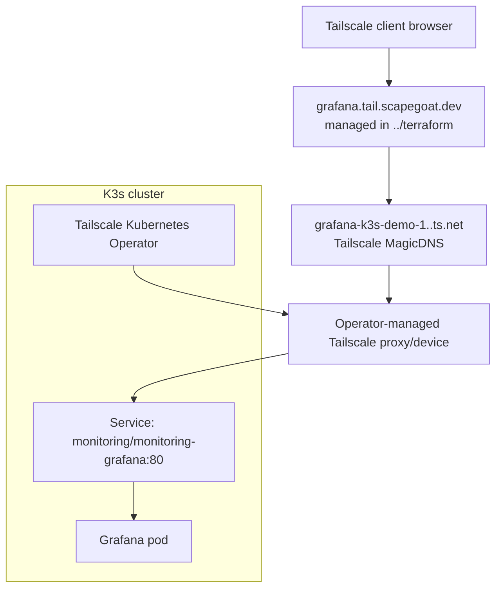

# Implementation Guide: Dedicated Tailnet DNS for Grafana

## Purpose

This playbook describes the revised implementation plan for exposing Grafana privately over Tailscale with a friendly DNS name:

```text
grafana.tail.scapegoat.dev
```

The plan no longer starts with a wildcard `*.tail.scapegoat.dev` reverse proxy. The wildcard idea was useful because it mirrors the public `*.yolo.scapegoat.dev` model, but it adds an unnecessary shared-routing requirement for the first private service. Instead, this plan uses **dedicated DNS records** and an **operator-first Tailscale Kubernetes design**.

The first target remains the existing Grafana service:

```text
monitoring/monitoring-grafana:80
```

The desired user-facing result is:

```text
Tailscale client browser
  -> grafana.tail.scapegoat.dev
  -> operator-managed Tailscale proxy/device
  -> monitoring-grafana.monitoring.svc.cluster.local:80
```

DNS for `scapegoat.dev` is managed in the sibling Terraform repo:

```text
/home/manuel/code/wesen/terraform
```

## Why the wildcard plan changed

A wildcard DNS record answers many names with the same DNS target:

```text
*.tail.scapegoat.dev -> 100.x.y.z
```

That works naturally for the public `*.yolo.scapegoat.dev` zone because public Traefik already exists as the shared host-based router:

```text
*.yolo.scapegoat.dev -> Hetzner public IP -> Traefik -> Kubernetes Ingress rules
```

For a private tailnet setup, there is no equivalent shared private HTTP router unless we create one. If every private name resolves to the same Tailscale IP, something at that IP must inspect the HTTP `Host` header and route:

```text
grafana.tail.scapegoat.dev    -> Grafana
prometheus.tail.scapegoat.dev -> Prometheus
argocd.tail.scapegoat.dev     -> Argo CD
```

That shared router is not bad, but it is additional architecture. The Tailscale Kubernetes Operator is a better fit for exposing individual Kubernetes Services as individual tailnet services/devices. Dedicated DNS records align with that model:

```text
grafana.tail.scapegoat.dev -> operator-managed Grafana Tailscale service
prometheus.tail.scapegoat.dev -> future operator-managed Prometheus service
```

The revised design keeps the nice naming convention of a private subdomain while avoiding a shared wildcard gateway on day one.

## Current design decision

Use these names unless deliberately changed during implementation:

| Concept | Value |
|---|---|
| Private DNS subdomain | `tail.scapegoat.dev` |
| First friendly DNS record | `grafana.tail.scapegoat.dev` |
| First Tailscale device/service hostname | `grafana-k3s-demo-1` |
| Kubernetes namespace for Grafana | `monitoring` |
| Existing Grafana Service | `monitoring-grafana` |
| DNS source of truth | `/home/manuel/code/wesen/terraform/dns/zones/scapegoat-dev/envs/prod` |
| Preferred DNS record type | `CNAME` to Tailscale MagicDNS name |
| DNS fallback | `A` record to stable Tailscale `100.x` IP |

The old `tailnet-ingress` namespace remains useful only if we later build a shared private ingress/gateway. For the operator-first dedicated-service path, the operator may create its own namespaces/resources depending on the chosen Tailscale installation method, and the Grafana exposure resource may live near the service or in a dedicated GitOps package such as `tailnet-services`.

## Architecture



The DNS record should preferably be a CNAME:

```text
grafana.tail.scapegoat.dev CNAME grafana-k3s-demo-1.<tailnet>.ts.net
```

A CNAME is preferable because Terraform does not need to know the Tailscale `100.x` IP. If the operator-managed device IP changes but the MagicDNS name remains stable, the friendly name continues to work.

If CNAME-to-MagicDNS is not practical with the DNS provider or client resolution path, use an A record fallback:

```text
grafana.tail.scapegoat.dev A 100.x.y.z
```

The A record fallback should be treated as slightly more operationally brittle because the DNS value depends on the device IP remaining stable.

## The Tailscale Kubernetes Operator role

The operator's job is to turn Kubernetes intent into tailnet resources. Instead of writing and maintaining a custom Tailscale sidecar, we install the operator and create Kubernetes resources that say, in effect:

```text
Expose monitoring/monitoring-grafana to the tailnet with hostname grafana-k3s-demo-1.
```

Depending on the selected operator mode, this might be expressed as:

- an annotated Kubernetes `Service`
- a `LoadBalancer` Service using Tailscale's load balancer class
- a Tailscale `IngressClass`
- Gateway API resources
- a `ProxyGroup` or related custom resource if using shared proxies

The exact mode must be selected after reading the current Tailscale Operator documentation. The preferred result is a simple, dedicated operator-managed proxy for Grafana first. Future services can repeat the pattern with their own DNS records.

## DNS model in ../terraform

Terraform owns the public DNS zone for `scapegoat.dev`. Even if the target is private to Tailscale, the friendly DNS record can still live in the public zone. A CNAME to a Tailscale MagicDNS name is not a secret; it is a convenience name. Only Tailscale-connected clients should be able to resolve/reach the target usefully.

The conceptual Terraform shape for the preferred CNAME is:

```hcl
resource "digitalocean_record" "grafana_tail" {
  domain = "scapegoat.dev"
  type   = "CNAME"
  name   = "grafana.tail"
  value  = "grafana-k3s-demo-1.<tailnet>.ts.net."
  ttl    = 60
}
```

If the implementation falls back to A records:

```hcl
resource "digitalocean_record" "grafana_tail" {
  domain = "scapegoat.dev"
  type   = "A"
  name   = "grafana.tail"
  value  = var.grafana_tailnet_ip
  ttl    = 60
}
```

The exact Terraform file/module layout must be inspected in:

```text
/home/manuel/code/wesen/terraform/dns/zones/scapegoat-dev/envs/prod
```

Do not put DNS records for this zone in the K3s repo.

## TLS and authentication model

There are three distinct security layers. Do not collapse them.

1. **Tailscale network access** decides which devices/users can connect to the tailnet service.
2. **TLS/browser security** decides whether the browser trusts the URL and whether cookies/redirects behave correctly.
3. **Grafana authentication** decides who the user is inside Grafana and which role they get.

For a first private endpoint, it is acceptable to validate reachability over Tailscale before solving custom-domain TLS completely. But the final desired user experience should be HTTPS.

Possible TLS paths:

- Use the operator/MagicDNS HTTPS path if browsing the MagicDNS hostname directly.
- Use DNS-01 certificate issuance for `grafana.tail.scapegoat.dev` or `*.tail.scapegoat.dev` if using the custom domain with HTTPS.
- Temporarily use HTTP over Tailscale/WireGuard only during bootstrap.

Grafana authentication must remain enabled. Do not enable anonymous Grafana simply because the endpoint is tailnet-only. The later application identity layer should use Keycloak OIDC as described in:

```text
docs/grafana-keycloak-access-playbook.md
```

For the custom tailnet hostname, the future Grafana `root_url` should likely become:

```text
https://grafana.tail.scapegoat.dev
```

and the Keycloak redirect URI should become:

```text
https://grafana.tail.scapegoat.dev/login/generic_oauth
```

## Phased implementation plan

### Phase 0: Confirm naming and DNS model

Confirm the revised plan before writing manifests:

```text
Subdomain:      tail.scapegoat.dev
First record:   grafana.tail.scapegoat.dev
DNS style:      dedicated records, not wildcard
Preferred type: CNAME to MagicDNS
Fallback type:  A record to 100.x IP
```

Exit criteria:

- The ticket title/body no longer implies wildcard is required.
- `grafana.tail.scapegoat.dev` is the first URL contract.
- Future services will get explicit records such as `prometheus.tail.scapegoat.dev`.

### Phase 1: Research current Tailscale Operator resource shape

Read the current Tailscale Kubernetes Operator docs and decide the exposure mode. Capture answers to these questions:

- How is the operator installed with Helm or static manifests?
- What credentials does it need?
- Can a Service be exposed directly with `tailscale.com/expose`?
- Is `tailscale.com/hostname` supported for the chosen mode?
- Should Grafana use an annotated Service, LoadBalancer class, Ingress, or Gateway API?
- Does the operator create one device per Service, or can/should we use ProxyGroup?
- What tags should the operator-created devices receive?

Exit criteria:

- A short design note is added to the diary with the selected operator mode.
- The exact manifests to create are known.

### Phase 2: Prepare Terraform DNS

In the sibling Terraform repo:

```bash
cd /home/manuel/code/wesen/terraform
export AWS_PROFILE=manuel
terraform -chdir=dns/zones/scapegoat-dev/envs/prod init
terraform -chdir=dns/zones/scapegoat-dev/envs/prod plan
```

Add the DNS record for the selected target. If using CNAME, the target is the operator-managed MagicDNS FQDN. If using A record fallback, the target is the operator-managed Tailscale IP.

Exit criteria:

- Terraform plan shows only the intended `grafana.tail.scapegoat.dev` record.
- No unrelated DNS records are modified.

### Phase 3: Install/configure the Tailscale Operator

Create GitOps resources for the operator, unless a deliberate decision is made to install it outside this repo. The likely desired files are:

```text
gitops/applications/tailscale-operator.yaml
gitops/kustomize/tailscale-operator/...
```

Credential handling must avoid committing secrets. Prefer Vault/VSO if feasible; otherwise document the bootstrap secret creation command and migrate to Vault later.

Exit criteria:

- The operator Argo CD Application is `Synced Healthy`.
- Operator controller pods are running.
- Credentials are not stored in Git.

### Phase 4: Expose Grafana through the operator

Create a GitOps package for the exposure resource. Possible paths:

```text
gitops/kustomize/tailnet-services/grafana.yaml
```

or:

```text
gitops/kustomize/grafana-tailnet/
```

The resource should expose:

```text
monitoring/monitoring-grafana:80
```

with a Tailscale hostname such as:

```text
grafana-k3s-demo-1
```

Exit criteria:

- Operator-created proxy/device appears in Tailscale admin console.
- MagicDNS name resolves for Tailscale clients.
- Direct access to the MagicDNS name reaches Grafana.

### Phase 5: Apply dedicated DNS record

Apply the Terraform DNS record:

```bash
cd /home/manuel/code/wesen/terraform
terraform -chdir=dns/zones/scapegoat-dev/envs/prod apply
```

Validate:

```bash
dig +short grafana.tail.scapegoat.dev
```

Exit criteria:

- The friendly DNS record resolves to the chosen MagicDNS target or `100.x` IP.
- A Tailscale-connected client can resolve and connect.
- A non-Tailscale client cannot route to the service.

### Phase 6: Validate Grafana behavior

From a Tailscale-connected client:

```bash
curl -I http://grafana.tail.scapegoat.dev
# or after HTTPS is configured:
curl -I https://grafana.tail.scapegoat.dev
```

Then open the URL in a browser and confirm:

- Grafana login appears.
- Anonymous access is not enabled.
- The `Hetzner Egress` dashboard is visible after login.
- The `Traefik Attribution` dashboard is visible after login.
- Grafana redirects, if any, do not send the user to the internal service name.

If redirects are wrong, set Grafana `root_url` in `gitops/applications/monitoring.yaml`.

### Phase 7: Harden access

Once basic access works, harden identity and TLS:

- Decide final HTTPS path for `grafana.tail.scapegoat.dev`.
- Configure Keycloak OIDC for Grafana if exposing to more than one operator.
- Store Grafana OAuth/client/admin secrets in Vault/VSO.
- Restrict Tailscale ACLs so only intended users/devices can reach the Grafana device.

Exit criteria:

- Grafana has both private network restriction and application login.
- Secrets are not generated ad hoc by Helm without an ownership plan.

## Future service pattern

After Grafana works, expose additional private admin services by repeating the dedicated-record pattern:

```text
prometheus.tail.scapegoat.dev   CNAME prometheus-k3s-demo-1.<tailnet>.ts.net
alertmanager.tail.scapegoat.dev CNAME alertmanager-k3s-demo-1.<tailnet>.ts.net
argocd.tail.scapegoat.dev       CNAME argocd-k3s-demo-1.<tailnet>.ts.net
```

Do not add a wildcard unless there is a clear need for a shared private gateway. Dedicated records are more explicit, easier to audit in Terraform, and better aligned with operator-managed service exposure.

## Exit criteria for HK3S-0025

The ticket is complete when:

- The Tailscale Kubernetes Operator path has been researched and selected.
- The operator is installed and healthy, or an explicit documented decision explains why implementation stopped before install.
- Grafana is exposed through an operator-managed Tailscale service/device.
- `grafana.tail.scapegoat.dev` is managed in `../terraform` as a dedicated DNS record.
- A Tailscale-connected client can reach Grafana through the friendly hostname.
- A non-Tailscale client cannot connect to the service.
- Grafana authentication remains enabled.
- The diary records exact resource names, DNS records, Tailscale names/IPs, commands, failures, and validation results.

## Failure modes

### CNAME resolves but the browser cannot connect

Check whether the Tailscale client can resolve and reach the MagicDNS target:

```bash
tailscale status
tailscale ping grafana-k3s-demo-1
```

If the MagicDNS target fails, fix the operator/Tailscale service before changing Terraform DNS.

### DNS works on one machine but not another

Check whether the failing machine is connected to Tailscale and using Tailscale DNS. Public DNS may return the CNAME, but the `.ts.net` target or the `100.x` address is only useful with Tailscale routing.

### Grafana loads but redirects incorrectly

Set `server.root_url` in Grafana values to the friendly URL.

### The operator creates a new device/IP after restart

Inspect operator/device lifecycle and whether the exposure mode uses stable identity. If using A record fallback, this breaks DNS. Prefer CNAME to stable MagicDNS name.

### TLS does not match the custom domain

MagicDNS TLS certificates are for `.ts.net` names, not `grafana.tail.scapegoat.dev`. Use DNS-01 custom-domain certificates or accept HTTP-over-tailnet only as a temporary bootstrap.
