# Report: Terraform-Managed Vault Admin Access Through Keycloak OIDC

This report explains how we made the `wesen` user able to log into the Yolo Vault as an administrator and write KV secrets, without handing around the Vault root token and without making a one-off manual Keycloak change. The concrete incident was simple: `vault login -method=oidc role=operators` reached Keycloak successfully, but Vault rejected the callback because the token had no `groups` claim. The fix was to make the existing `wesen` user a member of the `infra-admins` Keycloak group through Terraform.

The important lesson is larger than the single user. Vault OIDC access is not a password problem. It is a chain of claims and mappings: Keycloak emits identity facts, Vault checks those facts, and Vault's identity system maps accepted external groups to Vault policies. If any link in that chain is missing, login may appear to work until the final Vault callback fails.

> [!summary]
> This report preserves four ideas:
> 1. Vault OIDC admin access is a group-claim pipeline: Keycloak group membership becomes a `groups` claim, and Vault maps that claim to an internal policy.
> 2. The error `failed to fetch groups: "groups" claim not found in token` means Keycloak authenticated the user, but did not say the user belongs to a Vault-authorized group.
> 3. Terraform can manage membership for an existing Keycloak user without importing the full user, by combining `data.keycloak_user` with `resource.keycloak_user_groups`.
> 4. `exhaustive = false` is the crucial safety valve: Terraform grants the Vault admin group without deleting other user groups managed elsewhere.

---

## Why this note exists

We were preparing to deploy the Discord UI showcase bot to the Hetzner k3s cluster. That deployment needs a Vault secret at:

```text
kv/apps/discord-ui-showcase/prod/runtime
```

The secret contains the Discord bot token, application ID, guild ID, and related optional Discord application values. Writing that secret should be a normal operator action, not a root-token break-glass action. The expected operator path is:

```bash
export VAULT_ADDR=https://vault.yolo.scapegoat.dev
vault login -method=oidc role=operators
vault kv put kv/apps/discord-ui-showcase/prod/runtime ...
```

But the login failed with:

```text
failed to fetch groups: "groups" claim not found in token
```

That failure is worth documenting because it is easy to misread. It does not mean the browser login is broken. It does not mean the Vault callback URL is wrong. It means the user got through Keycloak, but Keycloak did not emit a group claim that Vault could use for authorization.

---

## Part 1: The system in one picture

The complete access path has five systems or concepts in play: the human user, Keycloak, an OIDC token, Vault's OIDC role, and Vault's policy engine. Each does a small job. The system works only when all jobs line up.

```mermaid
flowchart LR
    User[Human user: wesen] --> KC[Keycloak realm: infra]
    KC --> Group[Keycloak group: infra-admins]
    Group --> Token[OIDC token with groups claim]
    Token --> VaultRole[Vault auth/oidc/role/operators]
    VaultRole --> Alias[Vault external group alias: infra-admins]
    Alias --> Policy[Vault policy: admin]
    Policy --> KV[Write kv/* secrets]

    style User fill:#eef,stroke:#557
    style KC fill:#ffe,stroke:#aa7
    style Token fill:#efe,stroke:#585
    style VaultRole fill:#fef2f2,stroke:#b55
    style Policy fill:#e8f7ff,stroke:#278
    style KV fill:#e8ffe8,stroke:#393
```



Read this diagram from left to right. The human logs into Keycloak. Keycloak must know that the user belongs to `infra-admins`. The OIDC token must contain that group. Vault's `operators` role must accept that group. Vault's identity alias must map that external group name onto a Vault group. That Vault group must carry the `admin` policy. Only then does the resulting Vault token have permission to write under `kv/*`.

This is why the error message matters. A missing `groups` claim breaks the chain before Vault policy evaluation even begins. There is no Vault token yet. There is only an OIDC callback that Vault refuses to exchange for a token.

---

## Part 2: The mental model

Think of Vault OIDC login as a border crossing. Keycloak is the passport office. Vault is the border guard. The user can present a valid passport and still be refused entry if the passport lacks the visa stamp required for the destination.

In this setup, the visa stamp is the `groups` claim. Vault does not merely ask, "Did Keycloak authenticate this person?" It asks, "Did Keycloak authenticate this person **and** assert that they are in one of the operator groups I trust?" The distinction is essential. Authentication proves identity. Authorization decides what that identity can do.

The Vault role is configured to trust two group names:

```text
infra-admins
infra-readonly
```

The policy outcome depends on which group appears:

| Keycloak group | Vault external group alias | Vault policy | What the resulting Vault token can do |
|---|---|---|---|
| `infra-admins` | `infra-admins` | `admin` | Manage auth, identity, mounts, policies, and write `kv/*`. |
| `infra-readonly` | `infra-readonly` | `ops-readonly` | Inspect Vault configuration and read KV values/metadata. |
| no group claim | none | none | Login fails before Vault issues a token. |

For seeding application runtime secrets, `infra-readonly` is not enough. The operator must be able to write a KV path, so the correct group is `infra-admins`.

---

## Part 3: What was broken

The failing command was:

```bash
vault login -method=oidc role=operators
```

The login flow reached Keycloak at:

```text
https://auth.yolo.scapegoat.dev/realms/infra
```

The browser login completed, but Vault rejected the callback:

```text
Error authenticating: Error making API request.

URL: GET https://vault.yolo.scapegoat.dev/v1/auth/oidc/oidc/callback?...
Code: 400. Errors:

* failed to fetch groups: "groups" claim not found in token
```

There are two important observations here.

First, the callback reached Vault. That rules out the simplest redirect-URI failure. If the redirect URI were wrong, Keycloak would reject the auth request before returning a code to the Vault CLI.

Second, Vault specifically complained about the `groups` claim. That points at Keycloak user membership or Keycloak token mapping, not at the Vault root token, the Kubernetes cluster, or the Discord deployment script.

The existing Terraform environment already managed the `infra` realm, `vault-oidc` client, `infra-admins` group, `infra-readonly` group, and the `groups` protocol mapper. What it did not manage was the `wesen` user's membership in `infra-admins`.

---

## Part 4: Why Terraform was the right fix

A manual Keycloak UI change would have worked quickly: open `auth.yolo.scapegoat.dev`, switch to the `infra` realm, find the `wesen` user, and add it to `infra-admins`. But that would leave the most important fact outside source control. The next operator would not know whether the membership was intentional, accidental, or temporary.

The better fix was to express the desired membership in the Terraform environment that already owns the `infra` realm:

```text
/home/manuel/code/wesen/terraform/keycloak/apps/infra-access/envs/k3s-parallel
```

This is the same environment that manages the Keycloak side of Vault's OIDC login. Putting the membership there keeps the identity contract in one place:

```text
infra realm
  -> vault-oidc client
  -> groups claim mapper
  -> infra-admins group
  -> wesen is a member of infra-admins
```

The subtle question was whether Terraform needed to import the existing `wesen` user. Importing would make Terraform own the whole user object: username, email, profile fields, enabled state, and perhaps future drift. That is more ownership than we needed. The provider supports a better pattern: look up the existing user as data, then manage only the group membership.

---

## Part 5: The implemented Terraform pattern

The implemented code has two parts. First, Terraform looks up the existing user:

```hcl
data "keycloak_user" "wesen_operator" {
  count = var.manage_wesen_vault_admin_membership ? 1 : 0

  realm_id = module.realm.id
  username = var.wesen_operator_username
}
```

Then Terraform grants membership in the admin group:

```hcl
resource "keycloak_user_groups" "wesen_vault_admin" {
  count = var.manage_wesen_vault_admin_membership ? 1 : 0

  realm_id = module.realm.id
  user_id  = data.keycloak_user.wesen_operator[0].id

  group_ids = [
    keycloak_group.infra_admins.id,
  ]

  # Keep this resource additive so Terraform grants the Vault operator group
  # without removing groups that may be managed manually or by another IdP flow.
  exhaustive = false
}
```

The `exhaustive = false` line is the non-obvious part. A group-membership resource can be either authoritative or additive. Authoritative membership says, "These are all the groups this user should have; remove anything else." Additive membership says, "Ensure this group is present, but do not remove other memberships." For an operator identity, additive is safer. It avoids accidentally deleting groups that might have been assigned by another identity-provider mapper or by a separate administrative workflow.

Two variables make the behavior explicit:

```hcl
variable "manage_wesen_vault_admin_membership" {
  type        = bool
  default     = true
  description = "When true, look up the existing wesen user in the infra realm and add it to infra-admins for Vault operator write access."
}

variable "wesen_operator_username" {
  type        = string
  default     = "wesen"
  description = "Existing Keycloak username to grant infra-admins membership for Vault OIDC operator access."
}
```

The feature flag matters because not every environment necessarily has a `wesen` user. If a future environment reuses the module shape but does not have that user, it can set:

```hcl
manage_wesen_vault_admin_membership = false
```

---

## Part 6: The execution sequence

The Terraform environment uses an S3 backend, so the operator shell needed AWS credentials:

```bash
AWS_PROFILE=manuel terraform validate
```

The Keycloak provider also needed admin credentials for the K3s Keycloak instance. Those credentials were read from the in-cluster bootstrap admin secret without printing the password:

```bash
K3S_REPO=/home/manuel/code/wesen/2026-03-27--hetzner-k3s
TF_DIR=/home/manuel/code/wesen/terraform/keycloak/apps/infra-access/envs/k3s-parallel

export KUBECONFIG="$K3S_REPO/.cache/kubeconfig-tailnet.yaml"
export TF_VAR_keycloak_url="https://auth.yolo.scapegoat.dev"
export TF_VAR_keycloak_username="$(kubectl -n keycloak get secret keycloak-bootstrap-admin -o jsonpath='{.data.username}' | base64 -d)"
export TF_VAR_keycloak_password="$(kubectl -n keycloak get secret keycloak-bootstrap-admin -o jsonpath='{.data.password}' | base64 -d)"

cd "$TF_DIR"
AWS_PROFILE=manuel terraform plan -out=/tmp/hk3s-0026-infra-access.plan
AWS_PROFILE=manuel terraform apply -auto-approve /tmp/hk3s-0026-infra-access.plan
```

The plan was small:

```text
Plan: 1 to add, 2 to change, 0 to destroy.
```

The new resource was:

```text
keycloak_user_groups.wesen_vault_admin[0]
```

The two in-place changes were group descriptions being added to the already-existing `infra-admins` and `infra-readonly` groups. That was safe: Terraform already had descriptions in configuration, and the live objects lacked them.

The apply succeeded:

```text
Apply complete! Resources: 1 added, 2 changed, 0 destroyed.
```

A Keycloak Admin API readback confirmed the result:

```text
infra-admins
```

That is the key fact. After this point, the `wesen` user's OIDC token should contain the group needed by Vault.

---

## Part 7: How to verify the Vault side

Once the Keycloak membership exists, the human verification is short:

```bash
export VAULT_ADDR=https://vault.yolo.scapegoat.dev
vault login -method=oidc role=operators
vault token lookup
```

The important output is:

```text
identity_policies    [admin]
```

If the policy is `admin`, the user can write KV values under the current Vault admin policy. The secret seeding command for the Discord bot then becomes a normal operator action:

```bash
cd /home/manuel/code/wesen/2026-04-20--js-discord-bot

set -a
source ./.envrc
set +a

ttmp/2026/04/26/DISCORD-BOT-K3S-SHOWCASE-DEPLOY--deploy-discord-ui-showcase-bot-to-k3s/scripts/01-seed-discord-ui-showcase-vault.sh
```

The safe verification command lists keys, not values:

```bash
vault kv get -format=json kv/apps/discord-ui-showcase/prod/runtime \
  | jq -r '.data.data | keys[]'
```

Expected key names are:

```text
DISCORD_APPLICATION_ID
DISCORD_BOT_TOKEN
DISCORD_CLIENT_ID
DISCORD_CLIENT_SECRET
DISCORD_GUILD_ID
DISCORD_PUBLIC_KEY
source
```

---

## Part 8: Common failure modes

### Failure mode 1: `groups` claim not found

This was the triggering failure:

```text
failed to fetch groups: "groups" claim not found in token
```

It means the user authenticated, but Keycloak did not emit the group claim Vault requires. The usual causes are:

- the user is not in `infra-admins` or `infra-readonly`;
- the user exists in a different Keycloak realm than expected;
- the `groups` protocol mapper is missing or not attached to the `vault-oidc` client;
- the login is going through a different Keycloak hostname/environment than the one Terraform manages.

In this case, the fix was membership: add `wesen` to `infra-admins` in the `infra` realm on `auth.yolo.scapegoat.dev`.

### Failure mode 2: read-only access works but writes fail

If the user is in `infra-readonly`, Vault login may succeed, but writes will fail. That is correct behavior. `infra-readonly` maps to `ops-readonly`, which can inspect and read but not write KV data.

For app secret setup, use `infra-admins`.

### Failure mode 3: Terraform wants to create a duplicate user

Avoid this by using a data source for an existing user:

```hcl
data "keycloak_user" "wesen_operator" { ... }
```

Do not create a new `keycloak_user` unless Terraform is intended to own the whole lifecycle of that user. Creating a duplicate can fail on username/email uniqueness, and importing a full user can introduce unnecessary drift on profile fields.

### Failure mode 4: Terraform removes other user groups

Avoid this by setting:

```hcl
exhaustive = false
```

Without this, a user-groups resource may become an authoritative list and remove groups assigned elsewhere. For operator users, that can be surprising and risky.

### Failure mode 5: the wrong kubeconfig is used to read Keycloak bootstrap credentials

The public kubeconfig may time out depending on network/firewall state. The tailnet kubeconfig worked for this operation:

```text
/home/manuel/code/wesen/2026-03-27--hetzner-k3s/.cache/kubeconfig-tailnet.yaml
```

Use the tailnet path when reading in-cluster bootstrap secrets from an operator workstation.

---

## Part 9: What to remember

The key points to internalize:

- Vault OIDC login is both authentication and authorization. Keycloak must authenticate the user, and the token must contain a group Vault is configured to accept.
- The `groups` claim is the bridge between Keycloak and Vault. If the claim is absent, Vault cannot map the user to `admin` or `ops-readonly`.
- `infra-admins` is the correct group for writing application secrets. `infra-readonly` is useful for inspection, but not for seeding new KV values.
- Terraform can manage membership for an existing user without owning the user. Use `data.keycloak_user` plus `keycloak_user_groups`.
- `exhaustive = false` keeps the membership resource additive and avoids unintended group removal.
- The root token remains break-glass. Normal operator work should go through OIDC and a policy-bearing Vault token.

---

## Related project artifacts

- k3s ticket: `/home/manuel/code/wesen/2026-03-27--hetzner-k3s/ttmp/2026/04/26/HK3S-0026--manage-infra-vault-operator-user-membership-in-terraform`
- Terraform implementation: `/home/manuel/code/wesen/terraform/keycloak/apps/infra-access/envs/k3s-parallel/main.tf`
- Terraform variables: `/home/manuel/code/wesen/terraform/keycloak/apps/infra-access/envs/k3s-parallel/variables.tf`
- Vault OIDC bootstrap script: `/home/manuel/code/wesen/2026-03-27--hetzner-k3s/scripts/bootstrap-vault-oidc.sh`
- Vault OIDC operator playbook: `/home/manuel/code/wesen/2026-03-27--hetzner-k3s/ttmp/2026/03/27/HK3S-0005--enable-vault-keycloak-oidc-operator-login-on-k3s/playbooks/02-vault-k3s-oidc-operator-playbook.md`
- Discord bot deployment ticket: `/home/manuel/code/wesen/2026-04-20--js-discord-bot/ttmp/2026/04/26/DISCORD-BOT-K3S-SHOWCASE-DEPLOY--deploy-discord-ui-showcase-bot-to-k3s`

---

## Closing

This was a small change with a large operational effect. Before the fix, the `wesen` user could authenticate to Keycloak but could not cross the Vault authorization boundary because the token lacked group membership. After the fix, Terraform declares the missing membership, Keycloak emits the right claim, Vault maps the claim to the `admin` policy, and the operator can write KV values without touching the root token.

That is the pattern to reuse: when Vault OIDC fails, do not start with the root token. Follow the claim. Find what Keycloak says, what Vault expects, and which Terraform environment owns the missing fact.
